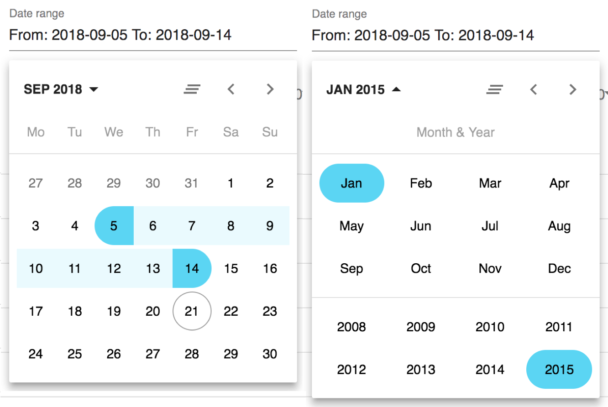

# Material Data Range Picker
> Accessible date range picker for material-ui



### Installation
Available as npm package.
```sh
npm i material-date-range-picker
```

### Acknowledgments

https://material.angular.io/components/datepicker/overview

https://github.com/geeofree/kalendaryo

https://github.com/paypal/downshift

https://github.com/dmtrKovalenko/material-ui-pickers

### LICENSE
The project is licensed under the terms of [MIT license](https://github.com/jonas-arkulpa/material-date-range-picker/blob/master/LICENSE)
